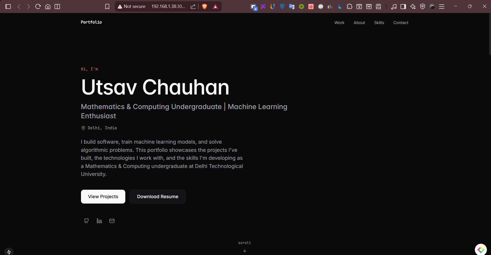

# Utsav Chauhan | Portfolio

A modern, responsive, and typography-first personal portfolio built to showcase my projects, technical skills, and experience in Software Development and Machine Learning.

## 🚀 Live Demo

**Portfolio:** nexus-portfolio-iota.vercel.app

> Replace the above URL after deployment.

---

## 📸 Preview

<!-- Add a screenshot after deployment -->



---

## ✨ Features

- Responsive design across desktop, tablet, and mobile
- Minimal, typography-first interface
- Smooth animations with Framer Motion
- Project showcase with GitHub links
- About, Skills, Experience, Education, and Contact sections
- Resume download
- SEO optimized with Open Graph, Sitemap, and Robots.txt

---

## 🛠 Tech Stack

- Next.js 15 (App Router)
- TypeScript
- Tailwind CSS
- Framer Motion
- Lucide React

---

## 📂 Featured Projects

- 🤖 GPT using Agentic AI
- 🎓 Student Dropout Prediction
- 🎙️ VOICEAID – AI Voice Assistant for Rural Users
- 🖼️ Image Captioning using CNN–RNN Fusion
- 🔍 Unsupervised Anomaly Detection using ResNet50

---

## ⚙️ Getting Started

Clone the repository:

```bash
git clone https://github.com/Utsav07-hub/Nexus-portfolio.git

Move into the project:

```bash
cd portfolio
```

Install dependencies:

```bash
npm install
```

Start the development server:

```bash
npm run dev
```

Open:

```
http://localhost:3000
```

---

## 📁 Project Structure

```
app/
components/
data/
hooks/
lib/
public/
styles/
types/
```

---

## 📜 Available Scripts

```bash
npm run dev          # Start development server
npm run build        # Create production build
npm run lint         # Run ESLint
npm run type-check   # Run TypeScript compiler
npm run format       # Format code with Prettier
```

---

## 📬 Contact

- **Portfolio:** https://your-vercel-url.vercel.app
- **GitHub:** https://github.com/Utsav07-hub
- **LinkedIn:** https://www.linkedin.com/in/utsav-chauhan-39b687294
- **Email:** utsavchauhan702@gmail.com

---

## 📄 License

This project is licensed under the MIT License.